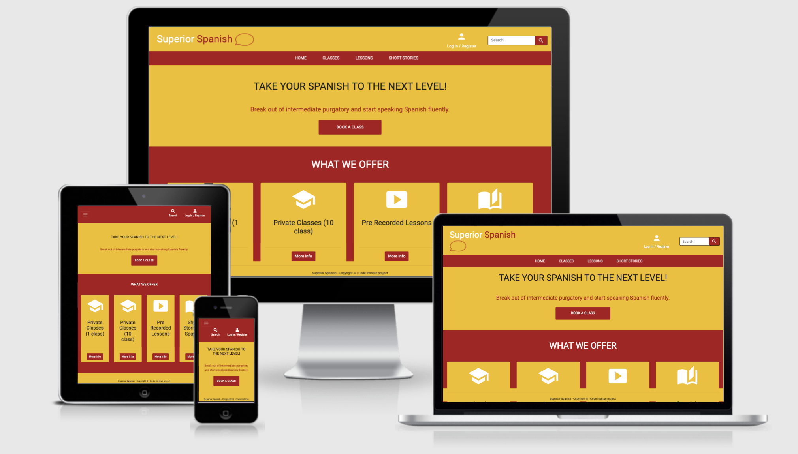
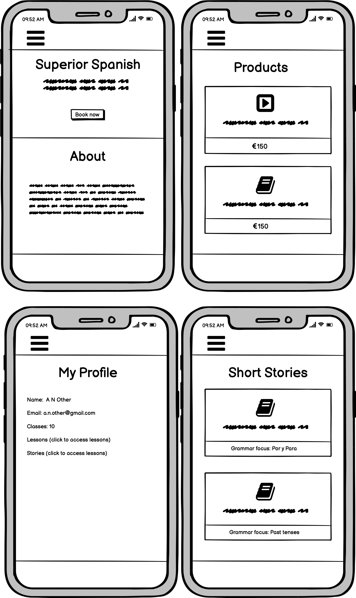
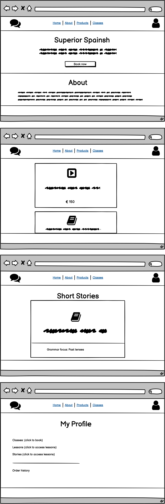

<h1 align="center">
  <a href="">Superior Spanish</a>
</h1>



[Superior Spanish - Live site](https://superior-spanish.herokuapp.com/)


*Note: This is an extension to the fictional organisation (Dublin Intercambio) created for my earlier Code Institute milestone projects.*

## Introduction
The organisers of Dublin Intercambio want to create an e-commerce site that allows that provides the opportunity for their memebers to purchase Spanish learning resources to truely enhance their Spanish. The majority of their members have at least an intermediate level of Spansih but are looking to take it to the next level. Moving from B1 to B2 or from B2 to C1 level is a big challenge, it requires dedication, motivatation and the of course the right resources to ensure success. 

Listening to the frustation of their members who had hit that intermediate plataue, a common phenomenon for language learners, the team at Dublin Intercambio decided to create some fanstastic resources, dedicated to supporting learning to move past the plataue and reach their language learning goals and they need a site while they can sell these resources as well as their classes.


## Scope 

Create a simple, intuitive, and responsive website that allows people to browse the services and products that are available, purchase these services, and create an account to save their payment details for future see their order history and access their purchases.

The structure should adhere to convention and be simple and intuitive, ensuring the user always knows where they are, how they got there and how to get back to 
where they started.

The design should be simple, utilising the same colour palette, as the other websites in the Dublin Intercambio site. However this time the design will focus mainly on the red and yellow from the colour paette with white and a dark grey used as contrasting colours when needed. The green from the palette will be used for any success messages.

Any addition features or functionally are out of scope at this stage.

User goals:
* To get information about what the products being sold.
* To get information about the person/company selling the product.
* To easily buy and enjoy the product.
* To create an account and save their payments details.


Website owners goals:
* To build on and expand the commuity of language learnings that are part of Dublin Intercambio.
* To create an easy and intuative way for users to buy their resources and services.
* To encourage users to continue interacting with the wider langaage learning community created by Dublin Intercambio.
* To build in the ability for admins to add, edit and delete products and services.
 
## UX

#### User stories

##### A typical user of this site would:
* Have an interest in improving their Spanish language skills.
* Have an interest in learning beyond an intermediate level.
* Have an interest in learning beyong the standard texbook approach.

##### User stories

Site User
1. As a site user, I want to understand the purpose of the site and how to interact with it.
2. As a site user, I want to understand what products and services are being sold so I can decide if the site and services are what I am looking for.
3. As a site user, I want to read reviews from people who have purchased the product so I can make an informed decision.
4. As a site user, I want to easily register for an account so that I can view my profile and purchases.
5. As a site user, I want confirmation that my account was successfully set up.
6. As a site user, I want to be able to log in and our easily so that I can access and protect my information.
7. As a site user, I want to be able to easily reset my password if I forget it, so that I can access my account.
8. As a site user, I want to be able to view my details in my own personal user profile page, so that I can view my information, purchase history and save my payment information.


Shopper
1. As a shopper, I want to view a list of products and services so that I can see what is available.
2. As a shopper, I want to view details of individual products and services so I can have all the information before deciding to purchase or not.
3. As a shopper, I want to view products and services by category, so that I can quickly find what I am looking for.
4. As a shopper, I want to have the option to search for a product or services, so that I can find the product or service I am looking for quickly.
5. As a shopper, I want to easily add my payment details so I can checkout quickly and easily..
6. As a shopper, I want to feel confident that my payment details are safe, so I feel comfortable purchinsg from the site.
7. As a shopper, I want to see conformation that my purchase was successful on screen, so that I am confident the purchase was successful.
8. As a shopper, I want to recieve an email confirmation after purchasing the product or service so that I an keep a record of what I have purchased.


Site owner
1. As a site owner, I want to be able to add a product or service to the site.
2. As a site owner, I want to be able to edit a product or service on the site so that I can update the information, price, etc.
3. As a site owner, I want to be able to edit the number of classes remaining for a user so that I can update the account if for any reason the class didn't take place.
4. As a site owner, I want to be able to delete a product or service from the site so that I can remove them if they are no longer available.


### Design (Wireframes and Mockups): 
The design is simple, modern, fully responsive and has a connection to the [Dublin Intercambio](https://donnaib.github.io/dublin_intercambio/) site from my Ms1 project, this connection will be achieved by utilising the same color palette and logo throughout. As before the inspiration for this colour palette was to harness the Spanish connection and influence of the project.

I am aware that yellow can sometimes be a problematic colour, however it remains an important element of the design due the fact that it is a key colour of the Spansih flag. With this in mind special I was careful to utilize the color in a way that added to the design of the site, but didn't not compromise the accessibility of the site.

Boostrap and Material Design icons are used throughout to realise the simple, modern and fully responsive design.

ADD IMAGE HERE OF THE COLOUR PALETTE.

I used Balsamiq to create detailed Wireframes for mobile and desktop site, for tablet devices the layout will follow either the mobile or desktop views depending on the size of the screen.

### Wireframes

#### Small Screen View


#### Larger Screen View



## Features

### Pages 

#### All Users

##### Home
The home pages is a simple, responsive bootstrap design that lets users easily see what is on offer, gives background information about the people behind the site and also provides, easy navigation and search option to ensure that users can easily find what they are looking for.

##### Products
All products are visible on the homes page, but the navigation also offers a way to filter the different products to view only classes, stories or lessons. From there there is a button to click to read more information about each product, with the option to buy.

#### Logged In Users

##### Profile
In addition to the above, logged in users will also see a profile page. This profile page will show users they order history and it will also provide 
access to their purchases. 
- If a user has bought classes, there will be a link to book a class. 
- If a user has bought short stories, there will be a link to view the stories
- If a user has bought pre recorded lessions, there will be a link to view the videos

#### Admin / Super Users
##### Add Product
In addition to all of the above, an admin or superuser will also be able to add, edit or delete products.
- When logged in a super user will find the option to 'Add Product' in the My Account drop down.  Clicking on this will take them to a page that is only
accessible by super users, with a form that will allow then to add a new product to the DB.

##### Edit or Delete Product
- When logged in a super user, if you view a product you will see the option to edit or delete at the bottom of the card under the 'More Info' button. Clicking edit, will take the user to a page only accesible to super users, where they will see a pre populated form, that they can edit.  Clicking on the delete option, will delete the product from the DB.

### Site Features 
Every page on this site also incorporates the following features:
* A logo in the top left hand corner, that not only forms part of the branding and design of the site but also as is consistent with a user's expectations, clicking the logo will return the user to the home page of the site.
* A responsive, collapsible navigation bar, allowing users to easily navigate the site on any device.
* A responsive footer.

### Possible Features to Implement in Future
* If more products or services are added to the site then I would look at adding a shopping bag to the site.
* Could possibly add reviews or testimonials to the site in the future.
* Feature to keep track of how many classes a user has purchased and how many have been use. Running total showing in user profile and admin option for a superuser to reduce the total by one every time a class has happened.
* Add a confirmation pop up on the delete product button.


## Technologies Used for building this site
- This project uses HTML, CSS and JavaScript programming languages.
- Gitpod was used an the IDE for building the site.
- **Bootstrap4** was used to assist with the structure, responsiveness and browser compatibility of the site. 
- BootstrapCDN was used to provide icons from **Font Awesome**. 
- **Material Design** was used to provide some of the icons in the nav and the product icons.
- **Google fonts** was used to style the website fonts.
- **jQuery** to reference Javascript needed for the responsive navbar.
- **Popper.js** to reference Javascript needed for the responsive navbar.
- **Stripe** was uses to process payments.

## Testing

I tested the site in the following ways:

1. Initially I used the inspector tool to test the site in all the screen sizes and devices available in the Chrome developer tool.  In addition to this I also tested it on live devices, including but not limited to iPhone, iPad, MacBook Pro, MotoG7. 

2. I also tested my code using the validator tools for both my HTML [W3C HTML Validator Tool](https://validator.w3.org/), CSS [W3C CSS Validator Tool](https://validator.w3.org/) and I also checked my JavaScript code using [JSHint](https://jshint.com/) Running my code through these tools highlighted a few issues with syntax which have been fixed.

Screen shots of the HTML & CSS validator results can be viewed below, as you can see there were no errors detected.


3. All links were tested to ensure there were no broken links and that all links to external sites open in a new tab.

4. In addition to testing with the inspector tool, real devices and validation tools, I also work through a series of test cases, to ensure that the site met the users stories and that any functionality that was added worked as intended.

### User Story Test Cases
Site User
1. As a site user, I want to understand the purpose of the site and how to interact with it.

	The site conforms to industry standards, has clear navigation and the home page sections clearly explain what the purpose of the site is.

2. As a site user, I want to understand what products and services are being sold so I can decide if the site and services are what I am looking for.

	The products and services are clearly laid out on the home page, with options to click through for further information, including pricing and a description, and the option to buy.

3. As a site user, I want to easily register for an account so that I can view my profile and purchases.

	When visiting the site there is an account icon in the navigation that is clearly marked "Login / Register", whicn opens a registration form when register is selected from the dropdown.

4. As a site user, I want confirmation that my account was successfully set up.

	When a user registers successfully a message is displayed on the screen to notify the user.

5. As a site user, I want to be able to log in and our easily so that I can access my purchases.

	When visiting the site there is an account icon in the navigation that is clearly marked "Login / Register", which opens a login form when login is selected from the dropdown.

6. As a site user, I want to be able to easily reset my password if I forget it, so that I can access my account.

	There is a forgot password link at the bottom of the log in page that allows a user to enter their email address. There will then receive an email with a link to click and they will be taken to a password reset page.

7. As a site user, I want to be able to view my details in my own personal user profile page, so that I can view my purchase history and access the purchases that I have already bought.

	When logged in, users will also see a profile page. This profile page will show users they order history and it will also provide 
	access to their purchases. 
	* If a user has bought classes, there will be a link to book a class. 
	* If a user has bought short stories, there will be a link to view the stories
	* If a user has bought pre recorded lessions, there will be a link to view the videos


Shopper
1. As a shopper, I want to view a list of products and services so that I can see what is available.

	The products and services are clearly laid out on the home page, with options to click through for further information, including pricing and a description, and the option to buy.

2. As a shopper, I want to view details of individual products and services so I can have all the information before deciding to purchase or not.

	As above, the products and services are clearly laid out on the home page, with options to click through for further information, including pricing and a description, and the option to buy.	

3. As a shopper, I want to view products and services by category, so that I can quickly find what I am looking for.

	The site navigation also offers a way to filter the different products to view only classes, stories or lessons. From there there is a button to click to read more information about each product, with the option to buy.

4. As a shopper, I want to have the option to search for a product or services, so that I can find the product or service I am looking for quickly.

	The site navigation has a search option to ensure that users can easily find what they are looking for.

5. As a shopper, I want to easily add my payment details so I can checkout quickly and easily.

	Once a user has chosen to buy an item, they are taken to the checkout page when a simple to use to form, with helpful validation messages. The form collects only the necessary information to make it quick and easy for the user to complete.

6. As a shopper, I want to feel confident that my payment details are safe, so I feel comfortable purchinsg from the site.

	Payments are done using stripe to ensure secure payment processing. View the [Stripe](https://stripe.com/ie) website for more information 

7. As a shopper, I want to see conformation that my purchase was successful on screen, so that I am confident the purchase was successful.

	When a successful purchase is made, a sucess message is shown on the screen and the user is redirected to their profile page to access their purchase.


Site owner
1. As a site owner, I want to be able to add a product or service to the site.

	When logged in a super user will find the option to 'Add Product' in the My Account drop down.  Clicking on this will take them to a page that is only
	accessible by super users, with a form that will allow then to add a new product to the DB.

2. As a site owner, I want to be able to edit a product or service on the site so that I can update the information, price, etc.

	When the site owner is logged in a super user, if they view a product the option to edit or delete will be visible at the bottom of the card under the 'More Info' button. Clicking edit, will take the user to a page only accesible to super users, where they will see a pre populated form, that they can edit. 

4. As a site owner, I want to be able to delete a product or service from the site so that I can remove them if they are no longer available.

	When the site owner is logged in a super user, if they view a product the option to edit or delete will be visible at the bottom of the card under the 'More Info' button. Clicking on the delete option, will delete the product from the DB.


### Functionally Test Cases

#### Allauth Authentication:
1. Test registration form by registering, ensure a verrificaiton email is received, follow the link then log in.
2. Test the validation of the registartion form but trying to enter a username with only 2 letters, ensure validation message is shown.
3. Once registered, log in and try to log in using new credentials to test the log in form. Ensure you are logged in and success message is shown.
4. Log out, then navigation back to the log in page, but this time click on the forgotten password link. Ensure an email is received and instructions can be followed.


#### Checkout
1. While logged in as a user or super user, selected a product to buy, and click the 'buy' button. Ensure you are taken to the checkout page.
2. Complete the form, enter 4242 4242 4242 4242 as the card number, a random three-digit CVC number, and any expiration date in the future. Ensure the payment success message is shown and you are redirected to your profile page with your new purchase showing.
3. Try to submit the form with no data and ensure the validation message is shown.
4. Try to submit the form with invalid data such as an expiration date from the past and ensure the error message is shown.
5. As an non logged in user try to buy a product and ensure you are redirected to the Log in page and a message is shown to asking the user to log in before purchasing.

#### CRUD:
1. While logged in as a superuser, chose "Add Product" from the My Account menu in the navigation. Ensure you are directed to the add product page and can complete the form and click the 'Add' button.
2. Navigate to the admin section and confirm the new product has been added. 
3. Navigate to the product page on the front end and make sure the new product is visible.
4. While logged in as a superuser, navigate to a product by selecting either Classes, Lessons or Stories from the navigation. Ensure you can see the opton to edit and delete. Click on edit. Ensure you are directed to the edit product page and can update the form and click the 'Edit' button.
5. Repeat steps 2 & 3 to ensure you can see the updated product information.
6. Repeat step 4 but this time select delete.
7. Repeat steps 2 & 3 to ensure the deleted product is no longer in the DB or visible on the Front End.


#### Security and Validation:
1. While logged out ensure the account icon says 'Log in / Register', then log in and make sure this changes to say 'My Account'
2. Try to make a purchase while logged out. Ensure you are redirected to the log in page with a message saying to log in before purchasing.
3. Log in, make a purchase of either Pre Recorded Lessons or Short Stories. Navigate back to the product page and try to purchase it again. Make sure the button says
	'View in Profile' and redirects you to your profile to access the resource you had previously purchased.
4. Navigate to the checkout page and enter invalid information such as an incorrect card number and ensure the validation message is shown. 
5. Navigate to the Add and Edit Product pages and add an invalid price such as 123356.99 and ensure the error message is shown.
6. While logged out try and access the Add, Edit & Delete Product pages, ensure you are redirect away from these pages and the error message is shown.
7. Repeat step 6 while logged in as a normal user.
8. Repeat step 6 while logged in as a super user and ensure you are taken to the form page and able to add and edit a product.


### Accessibility
In addition to all the above testing I also checked my site with accessibility tools in the inspector. 

### Bugs & Issues

* When connecting my database I accidentally commited my DATABASE_URL to github. I realised what I had done and knew that I had to fix this error.  I deleted the DB I had already created and created a new one so that they details that were in Gitpod were rendered useless and I started again with a new DB and made sure not to commit that to Github.  

* I deployed early as advised but this seemed to cause a migration issue. I worked with a channel lead to help debug an error I was seeing in live but not locally. I was getting a 500 error when I tried to access admin in the live site but no issues locally. In the end I had to temporarilty add my Postgres DB detailts for settings.py and check for a migration, there was one waiting to run, I ran it and that solved the issue.

## Deployment. 

### Requirements

- Python3
- PIP package installation
- Github account
- Heroku account
- Heroku Postgres 

There are XX models for this site.
1. 
2. 
3.
4. 
(See DB design for details of the documents within each collection)


### How to run this project locally
To clone this project from GitHub:
1. Follow this link to the [Project GitHub repository](https://donnaib.github.io/superior_spanish).
2. Under the repository name, click 'Code'
3. In the Clone with HTTPs section, copy the clone URL for the repository. 
4. In your local IDE open Git Bash.
5. Change the current working directory to the location where you want the cloned directory to be made.
6. Type ```git clone```, and then paste the URL you copied in Step 3.
```console
git clone https://github.com/DonnaIB/superior_spanish.git
```
7. Hit enter and your local clone will be created.

8. Open the index.html file to run the project locally

9. Create a file called env.py. Your app's environmental variables should be added to this file

10. The env.py file should contain the following information:


		os.environ['SECRET_KEY'] = ''
		os.environ['DEVELOPMENT'] = 'dev'
		os.environ['STRIPE_PUBLIC_KEY'] = "< add your key details here >"
		os.environ['STRIPE_SECRET_KEY'] = "< add your key details here >"
		os.environ['STRIPE_WH_SECRET'] = "< add your key details here >"
		
11. Check that the env.py file is listed in the .gitignore file

12. Run the app locally by typing 'python3 manage.py runserver' in the terminal


### Heroku Deployment 

1. Create a requirements.txt and Procfile:
	
	 - 'pip3 freeze --local > requirements.txt'
	 - 'echo web: python run.py > Procfile'
	

2. Push the above files to your Github account
3. Log into Heroku and create a new app: 
	
	- Click 'New' and select 'Create new app'
	- Choose a name for the app (remember this must be a unique name)
	- Choose your region
	- Click 'Create app' button

4. Connect to Github:
	
	- If not already on the Deploy tab, click the Deploy tab
	- Select Github as the deployment method and enter your Github details as prompted
	- Select the correct repsoitory and click connect

5. Add Config Vars:

	- Click on the settings tab
	- In the Config Vars section click 'Revel Config Vars'
	- Enter the key value pairs.

			AWS_ACCESS_KEY_ID
			AWS_SECRET_ACCESS_KEY
			DATABASE_URL
			EMAIL_HOST_PASS
			EMAIL_HOST_USER
			SECRET_KEY
			STRIPE_PUBLIC_KEY
			STRIPE_SECRET_KEY
			STRIPE_WH_SECRET
			USE_AWS

6. Set up DB

	- Temporarily add the DATABASE_URL to settings.py:

		DATABASES = { 'default': dj_database_url.parse('your_postgres_database_url') }

		Migrate the data from development to production version.

		To migrate the database models in the project to the Postgres database use the following command:
		
			'python3 manage.py migrate'

	- Create superuser for the Postgres database with the following command:

		'python3 manage.py createsuperuser'

	- Remove the Postgres database URL from settings.py as this should not in any case be deployed to GitHub for security reasons.


6. Deploy the App
	
	- In the Automatic Deploys section choose a branch to deploy
	- Click Enable Automatic Deploys

7. When the app build is complete, click 'Open App' button to open the app


## Credits

### Content
The content of the site was written by myself and inspired by previous fictional projects.

### Code
- Code for my footer was adapted from my Ms3 project. 


### Acknowledgements
* My color scheme for this site was based on the colors in the Spanish flag and I used a colour scheme from [Scheme Color](https://www.schemecolor.com/spain-flag-colors.php), the specific color combination was created by user Keshav Naidu.
* Massive thanks to Melinda Zhang who helped me debug an issue I was having due to a migration only running locally.
* A final thank to my mentor Rahul Lakhanpal who has advised and guided me through this Milestone 4 project.
